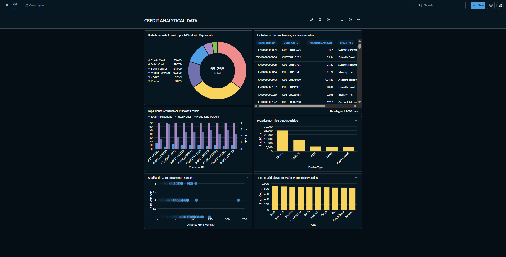

# 🏦 Bank Fraud Analytics Platform

### Pipeline de dados de detecção e análise de fraudes bancárias

Construído com **Google Cloud Storage**, **BigQuery**, **Docker** e **Apache Superset**

---

## 📌 Visão geral

Este projeto simula o pipeline analítico de um banco para **identificar, mensurar e investigar fraudes em transações financeiras**. Os dados brutos (~1 milhão de transações) são ingeridos em um Data Lake no Google Cloud Storage, modelados em camadas dentro do BigQuery (Raw → Analytical) seguindo uma abordagem **dimensional**, e disponibilizados em um dashboard interativo via Apache Superset, rodando em container Docker.

> 📊 Dataset original: [Bank Transaction Fraud Detection Dataset (Kaggle)](https://www.kaggle.com/datasets/nafiulislam490/bank-transaction-fraud-detection-dataset)

  
  
<em>Dashboard final no Metabase — visão consolidada de fraudes por método, dispositivo, localização e comportamento</em>

---

## 🎯 Problema de negócio

Bancos processam milhões de transações diariamente e precisam responder, em tempo quase real:

- Em quais **métodos de pagamento e dispositivos** a fraude é mais concentrada?
- Quais **clientes** apresentam maior risco (taxa de fraude histórica)?
- Existe relação entre **distância da transação em relação à residência do cliente** e tentativas de login falhas com a ocorrência de fraude?
- Quais **localidades** concentram o maior volume de fraudes?

Este projeto responde a essas perguntas construindo uma base analítica confiável a partir de dados brutos heterogêneos (5 fontes distintas: transações, clientes, localização, comportamento e marcação de fraude).

---

**Fluxo resumido:**
1. **Ingestão**: arquivos CSV (`;` delimitado, com inconsistências propositais) são enviados ao GCS.
2. **Raw Layer**: tabelas externas no BigQuery leem o CSV diretamente do bucket, sem transformação (schema-on-read).
3. **Analytical Layer**: tratamento de tipos com `SAFE_CAST`/`SAFE.PARSE_DATE` (proteção contra dados malformados), criação de dimensões e views de negócio.
4. **Visualização**: Metabase consome as views via container Docker, expondo um dashboard interativo.

---

## 📊 Principais insights identificados

A partir das views analíticas, o dashboard revela, por exemplo:

- **55.255 transações fraudulentas** identificadas no total da base analisada.
- **Cartão de crédito (35,4%) e cartão de débito (29,7%)** concentram a maioria das fraudes, seguidos de transferência bancária (15%).
- **Mobile** é o dispositivo com maior volume absoluto de fraude, seguido por Desktop.
- Transações com **maior distância da residência do cliente** tendem a se concentrar entre 3 e 5 tentativas de login falhas — um padrão clássico de comportamento suspeito.
- Cidades como **Paris, Nova York e Munique** aparecem entre as localidades com maior volume de fraude na amostra.

## 📄 Licença

Este projeto está sob a licença MIT — veja [LICENSE](LICENSE) para mais detalhes.
O dataset utilizado é de domínio público no Kaggle, sob a licença definida pelo autor original.
